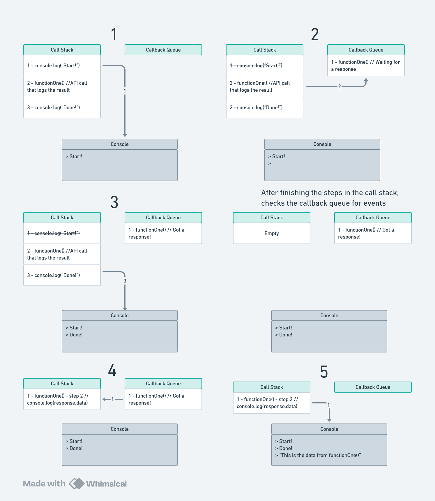

# Promises and JavaScript's event loop

## Introduction

Promises can be difficult to understand, when we are first learning about them. Why do we need them? What problem are they solving? How do they work? These are all valid questions that I'll try to answer below. This guide does **not** explain the syntax or inner workings of Promises. Instead, it will help you understand at a high level how they work, which should make the syntax a little easier to follow.

Before we can do any of that, we need to cover some basic concepts:

### Basic concepts

- **Instructions**: When we write code, we are effectively writing a set of **instructions** for the computer to follow
- **Single Threaded**: JavaScript can only use one thread in your CPU. This means that it can only execute one set of instructions at a time and can't do work in parallel\*.
  - Even when it looks like JS is doing two things at once, it's _actually_ just witching back and forth really fast!
  - \*: Technically we can use something called _web workers_ or _worker threads_ which allow us to use more than one CPU thread for some tasks, but that's way outside our scope today
- **Types of instructions**:
  - **Blocking** instructions keep the main thread busy until they finish, meaning that no other work can get done
  - **Non-blocking** instructions can be started, and allow JS can move on to the next instruction while waiting for a response.
    - A good example is making an API call - you will **never** get a response immediately, and sometimes it can take a (comparatively) long time, so it's better to do something else while you wait!
- **Event Loop**: The sequence of events that the JavaScript engine goes through while running a program. It is quite complex, but we are going to focus on two things:
  - **Call stack**: A list of instructions that JS will execute. Like a "to-do" list that JS tackles one item at a time, from top to bottom.
  - **Callback queue**: A set of instructions that are "paused", waiting for an event to happen (such as an API response or a timer running out). Once the event happens, the instructions get added back into the call stack for processing

### The problem

Imagine we have two functions that make API calls. For now we will call them functionOne() and functionTwo() (for obvious reasons). They look something like this:

```js
/* 
  Note 1: This is NOT the correct syntax! Just an illustration. 
  Note 2: callApi is a (made up) function, to keep the example simple.
*/
function functionOne() {
  const firstApiCall = callApi("first-api-url.com", { method: "GET" }); //Always takes at least 10 seconds

  console.log("Here is your data:", firstApiCall.data);
}

function functionTwo() {
  const secondApiCall = callApi("second-api-url.com", { method: "GET" }); //Always takes 5 seconds

  console.log("Here is your data:", secondApiCall.data);
}
```

If you've dealt with API calls before, you may notice there's a problem here. JS doesn't know it needs to _wait_ for the API calls to get a response! So it will make the call, then immediately try to read response's `data` value. The response will be `undefined` because the the API hasn't replied yet and trying to read `(undefined).data` is impossible and will throw an error.

We need to have a way to tell JavaScript to wait for the response before executing the next instruction in that function! That's where Promises come in

### Promises

Promises allow us to tell JavaScript "Run this instruction, then wait for a response. When you get a response, follow the rest of the instructions". This fixes the original problem above but presents us with a new problem. Since JS is single-threaded, it can only do one thing at a time, which means it will sit there and wait for the response doing nothing!

firstApiCall() takes 10 seconds, and secondApiCall() 5. If we do them one after the other, we'll have to wait 15 seconds!

Can we do any better? Yes! The JS event loop can help us reduce our wait time. Let me give you a (simplified) explanation of this event loop below.

## The JavaScript Event Loop

We are going to focus on two components of the event loop, the **call stack** and **callback queue**.

JavaScript will follow all instructions in its call stack, one at a time. But callbacks are a special kind of instruction that allow JS to start processing something, pause, and set a reminder (a task in the callback queue) to wait for a certain event to happen before continuing with those instructions. In the meantime, JS can move on to the next instruction in the call stack. This means that Promises are **non-blocking**!

When JS finishes going through all the tasks in the call stack, it will look at the callback queue and see if any of the events happened. If they did, JS will add the steps for handling those events to the call stack and continue processing them.

<details>
<summary>Click here to view an example diagram</summary>



</details>

## Putting it all together

Promises allow us to wait for an event to happen, and the event loop (thanks to the callback queue) allows us to do other things while we wait.

If you recall, firstApicall() took 10 seconds to resolve, and secondApiCall() 5. By leveraging promises and the event loop, we can _start_ firstApiCall() and register it to the callback queue without waiting for a response. Then we _start_ secondApiCall() and do the same.

- secondApiCall() will return first, after 5 seconds
- firstApiCall() will return second, 5 seconds after secondApiCall() returned (so 10 seconds total)

Total wait time? 10 seconds! And this would be the same even if we had many Promises happening together. For example, if we had 100 API calls to make, **we would only need to wait for the slowest one to complete, because the other ones will be handled during this wait time**.

Having said that, we still need to tell JavaScript that it needs to wait for a Promise to resolve. There are two ways of doing this, using the `Promise` syntax and the `async/await` syntax. Both work the same when the program runs, they are just different ways of writing and organizing code.

Going into all of the syntax details of `Promises` and `async/await` is beyond the scope of this explanation, but here is a simplified example:

```js
//Note: callApi is (still) a made up function for illustration purposes

// Using Promise syntax
function functionOne() {
  const firstApiCall = new Promise((resolve, reject) => {
    return callApi("first-api-url.com", { method: "GET" }); //Always takes at least 10 seconds return firstApiCall.data;
  });

  firstApiCall.then((response) => console.log("Here is your data:", response.data));
}

// Using async/await
async function functionTwo() {
  const secondApiCall = await callApi("second-api-url.com", { method: "GET" }); //Always takes 5 seconds

  console.log("Here is your data:", secondApiCall.data);
}
```

This is still not the ideal syntax - this code wouldn't handle errors very well! If you are curious

<details><summary>this is what a better version of the code would look like</summary>

The .catch block in promises and try/catch syntax for async/await allows us to gracefully handle errors. There are other options regarding syntax that allow you to do different things, but I don't want to get even further away from our scope here!

```js
function functionOne() {
  const firstApiCall = new Promise((resolve, reject) => {
    return callApi("first-api-url.com", { method: "GET" });
  });

  firstApiCall
    .then((response) => console.log("Here is your data:", response.data))
    .catch((error) => {
      console.log("Oh no! An error!", error);
    });
}

async function functionTwo() {
  try {
    const secondApiCall = await callApi("second-api-url.com", { method: "GET" }); //Always takes 5 seconds

    console.log("Here is your data:", secondApiCall.data);
  } catch (error) {
    console.log("Oh no! An error!", error);
  }
}
```

</details>

## Summary

Promises allow us to gracefully wait for certain events (like timers to complete or API responses to return) to happen before executing certain code that requires those events.

The event loop allows us to do other things while waiting for those events. Together, this helps make your JavaScript code much faster!
